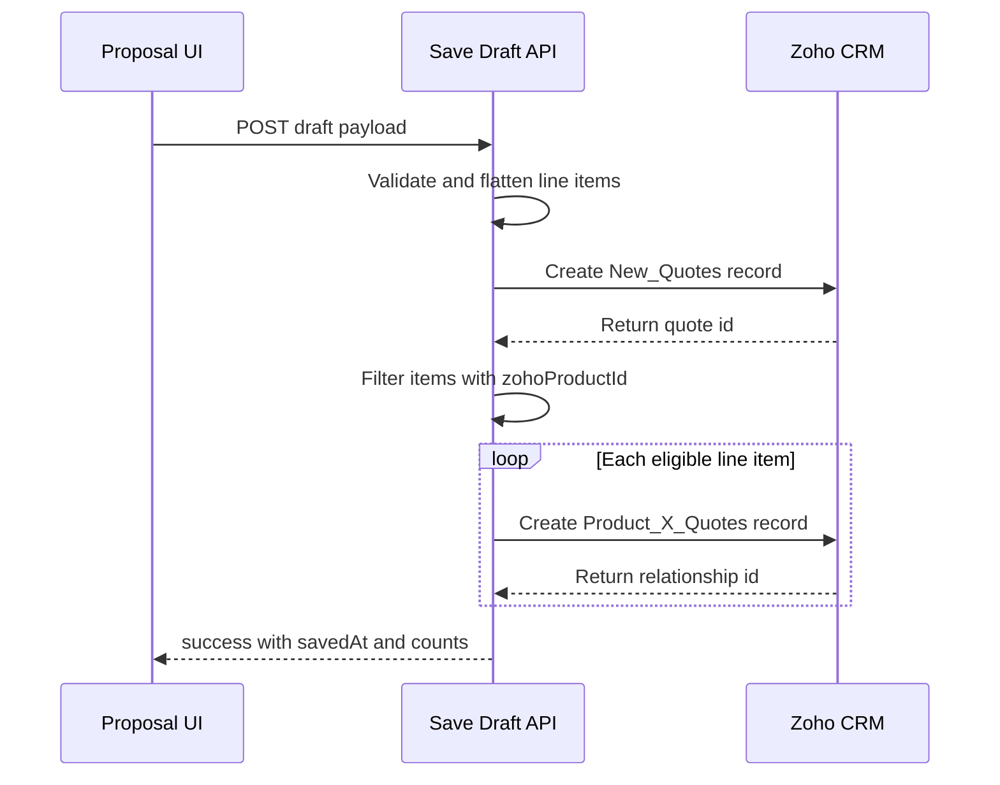
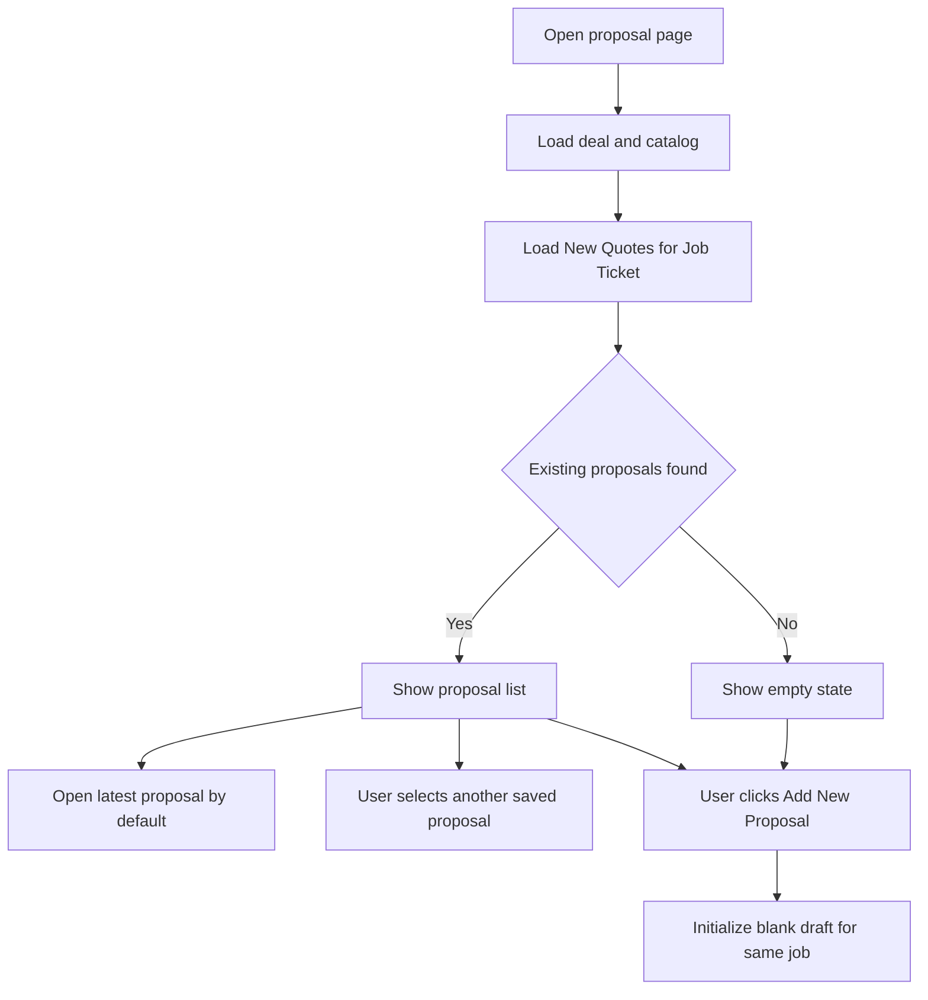
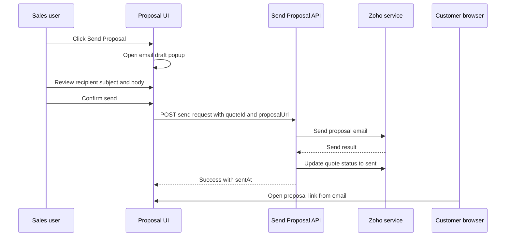

# Save Draft Integration Plan

## Objective

Wire the Save Draft action from [`handleSaveDraft`](../components/proposal/ProposalPageClient.tsx:199) to a Next.js API route that:

1. creates one record in `New_Quotes`
2. then creates one record in `Product_X_Quotes` for each catalog-backed line item that has a Zoho product id
3. skips manual line items that do not map to a Zoho product lookup

## Current State

- [`handleSaveDraft`](../components/proposal/ProposalPageClient.tsx:199) only simulates a save with a delay and updates [`lastEditedAt`](../lib/mock-data.ts:25) locally
- [`ZohoCRMClient`](../lib/zoho/ZohoCRMClient.ts:26) currently supports token retrieval plus generic GET requests through [`makeRequest`](../lib/zoho/ZohoCRMClient.ts:92), but it does not yet expose create-record helpers
- Proposal data is currently client-managed with sections and line items defined by [`Proposal`](../lib/mock-data.ts:19), [`ProposalSection`](../lib/mock-data.ts:13), and [`LineItem`](../lib/mock-data.ts:5)
- Catalog items already come from Zoho products in [`getProposalData`](../lib/mock-data.ts:196), but the current mapped type [`CatalogItem`](../lib/mock-data.ts:39) does not retain the Zoho product id in a dedicated field for save-back use
- [`ProposalPage`](../app/proposal/[jobId]/page.tsx:6) currently loads one working proposal context for a job, but it does not fetch or display previously saved quote drafts from `New_Quotes`
- [`ProposalHeader`](../components/proposal/ProposalHeader.tsx:15) exposes Save Draft, Preview, and Send actions, but it does not provide an entry point for starting a new blank proposal while staying on the same job

## Existing Proposal Discovery Plan

### Goal

When the user opens a job proposal page, the application should check `New_Quotes` for existing quote records linked to the current `Job_Ticket`. If records exist, show them as selectable list items. The UI should also expose an Add New Proposal action that starts a blank proposal for the same job.

### Retrieval strategy

Extend [`getProposalData`](../lib/mock-data.ts:196) or introduce a companion server-side loader so [`ProposalPage`](../app/proposal/[jobId]/page.tsx:6) returns:

1. the current job metadata
2. the product catalog
3. a list of existing `New_Quotes` records filtered by `Job_Ticket`
4. one active proposal model to open in the editor

Recommended query target:

- module: `New_Quotes`
- filter basis: `Job_Ticket` lookup equals the current job id
- fields to fetch initially:
  - `id`
  - `Name`
  - `Quote_Status`
  - `Modified_Time`
  - `Created_Time`
  - `Job_Ticket`

If Zoho search-by-lookup is awkward in one endpoint, the implementation can use either:

- a search endpoint with a criteria expression for `Job_Ticket`
- or a generic records call plus a server-side filter as a temporary fallback during development

### Proposal list model

Add a lightweight summary type for the left-side or top-side proposal selector UI.

Recommended shape:

```ts
type ExistingProposalSummary = {
  id: string;
  name: string;
  status: string;
  modifiedTime?: string;
  createdTime?: string;
  isActive?: boolean;
};
```

### Initial page behavior

When [`ProposalPage`](../app/proposal/[jobId]/page.tsx:6) loads:

1. fetch all existing proposals for the current `Job_Ticket`
2. if one or more proposals exist:
   - render them as selectable list items
   - choose a default active item for the editor
3. if none exist:
   - render an empty-state message
   - initialize the editor with a blank draft model

Recommended default active selection:

- use the most recently modified quote as the active proposal
- if the route later supports a `quoteId` search param, prefer the explicitly requested proposal over the latest record

## Add New Proposal Plan

### Expected behavior

The Add New Proposal button should not duplicate the current proposal. It should reset the editor into a fresh blank draft for the same job context.

### UI placement

Add the button near the proposal list or in [`ProposalHeader`](../components/proposal/ProposalHeader.tsx:15), depending on layout preference during implementation.

Recommended label:

- `Add New Proposal`

### State behavior

Clicking Add New Proposal should:

1. clear the active saved quote selection
2. initialize a new in-memory proposal object with blank draft values
3. retain the current job context from [`jobMeta`](../lib/mock-data.ts:29)
4. keep the existing proposal list visible so users can switch back to a saved proposal
5. treat the next Save Draft action as a create operation for a brand new `New_Quotes` record

### Active proposal rules

The editor should support two modes:

- existing proposal mode with an active quote id
- new proposal mode with no quote id yet

This distinction is important because the first Save Draft in new proposal mode creates a new quote, while a future enhancement may allow updating an existing `New_Quotes` record instead of always inserting a new one.

## Send Proposal by Email Plan

### Goal

Allow the user to send the currently selected saved proposal to the client by email. Before sending, the user must review and draft the email in a popup, then finalize the send. The email should contain a client-facing proposal link that opens the selected proposal in the preview flow.

### Preconditions

The send flow should only be enabled when there is an active saved quote id.

Required preconditions:

- a `New_Quotes` record already exists for the active proposal
- the user has selected either an existing saved proposal or just saved a new draft successfully
- a recipient email can be resolved from the Zoho deal or quote contact data

If the proposal is still a brand-new unsaved draft, [`handleSend`](../components/proposal/ProposalPageClient.tsx:210) should not send immediately. Instead, the UI should require the user to save the draft first or auto-save before opening the send popup.

### Link behavior

The email should include a proposal URL that opens the currently selected saved quote in the client-facing preview experience.

Recommended destination:

- base preview route remains [`app/p/[jobId]/page.tsx`](../app/p/[jobId]/page.tsx:4)
- add a quote-specific selector so the link opens the correct saved quote, for example by introducing a `quoteId` search param or a dedicated route segment

Recommended final link shape:

- `/p/[jobId]?quoteId=<savedQuoteId>`

This keeps the current route structure compatible while allowing a specific saved proposal to be loaded for the client.

## Email Draft Popup Plan

### UI behavior

Clicking Send Proposal from [`ProposalHeader`](../components/proposal/ProposalHeader.tsx:15) should open a popup or modal instead of sending immediately.

Recommended modal responsibilities:

- show the selected proposal name
- show the default recipient email
- allow editing the recipient email before send
- allow editing the email subject
- allow editing the email body
- show the generated proposal link
- provide Cancel and Send actions

Recommended component:

- [`components/proposal/SendProposalModal.tsx`](../components/proposal/SendProposalModal.tsx)

### Default fields

The modal should prefill:

- recipient email from Zoho deal or quote contact data
- subject using proposal name and company context
- body using a simple proposal-introduction template
- proposal link for the currently selected saved quote

Recommended draft model:

```ts
type ProposalEmailDraft = {
  quoteId: string;
  jobId: string;
  toEmail: string;
  subject: string;
  body: string;
  proposalUrl: string;
};
```

## Email Delivery Architecture

### Client to server flow

The popup should submit to a Next.js API route such as [`app/api/proposals/send/route.ts`](../app/api/proposals/send/route.ts).

Recommended request shape:

```ts
type SendProposalRequest = {
  quoteId: string;
  jobId: string;
  toEmail: string;
  subject: string;
  body: string;
  proposalUrl: string;
};
```

### Server responsibilities

The send API route should:

1. validate required fields
2. confirm the referenced quote exists and is eligible to send
3. confirm the quote belongs to the current job
4. optionally update quote status from draft to sent if that is part of the business workflow
5. send the email via Zoho mail-related services or CRM email functionality
6. record send metadata back onto the quote when supported
7. return a normalized send result to the UI

Recommended response shape:

```ts
type SendProposalResponse = {
  success: boolean;
  quoteId: string;
  sentAt: string;
  recipient: string;
};
```

## Zoho Integration Plan for Email Send

### Delivery source

The plan should assume a Next.js API route orchestrates the send, while Zoho handles the actual outbound email.

This means [`ZohoCRMClient`](../lib/zoho/ZohoCRMClient.ts:26) will likely need additional helpers for:

- quote lookup before send
- quote update after send if status needs to change
- email-send endpoint integration if available in the selected Zoho service

### Suggested server flow

1. receive `SendProposalRequest`
2. fetch the active `New_Quotes` record by `quoteId`
3. verify the quote is associated with the requested `jobId`
4. build the outbound email payload with subject, body, and proposal link
5. send through Zoho email capability
6. if send succeeds:
   - update `New_Quotes.Quote_Status` to the sent value if required
   - optionally write send timestamp metadata if the module supports it
7. return success to the client popup

### Status transition

Recommended status behavior:

- `Save Draft` keeps `New_Quotes.Quote_Status` in draft
- successful email send moves it to sent

The exact sent picklist value should be confirmed during implementation.

## Client Preview Plan

### Requirement

When the client clicks the link in the email, they should see the correct proposal.

### Route strategy

Enhance [`ClientPreviewPage`](../app/p/[jobId]/page.tsx:4) and the underlying data loader so the preview route can resolve the intended saved proposal instead of only loading generic job data.

Recommended logic:

1. parse `quoteId` from the URL
2. fetch the selected `New_Quotes` record by that id
3. fetch related `Product_X_Quotes` rows for that quote
4. rebuild the proposal content for preview rendering
5. render the proposal through [`ProposalPreviewClient`](../components/proposal/ProposalPreviewClient.tsx:1)

If `quoteId` is missing or invalid, show a safe error state rather than falling back to the wrong proposal.

## Send Flow State Management

Update [`ProposalPageClient`](../components/proposal/ProposalPageClient.tsx:27) to manage send-modal state.

Recommended client state additions:

- `isSendModalOpen`
- `isSendingProposal`
- `activeQuoteId`
- `activeRecipientEmail`
- `sendError`

Recommended `handleSend` behavior replacing the placeholder in [`handleSend`](../components/proposal/ProposalPageClient.tsx:210):

1. ensure there is an active saved quote id
2. if not, block send and instruct the user to save first
3. build default email draft values
4. open the send modal
5. on modal confirmation, submit to send API route
6. update local proposal status on success
7. show success feedback and close modal

## Validation Rules for Email Send

Validate before calling Zoho:

- `quoteId` must exist
- `jobId` must match the quote's linked job
- `toEmail` must be present and valid
- `subject` must not be empty
- `body` must not be empty
- `proposalUrl` must be generated from an allowed app base URL

## Error Handling Rules for Email Send

### Pre-send validation failure

- keep the modal open
- show inline validation messages
- do not call the send API

### Zoho send failure

- keep the proposal saved but unsent
- do not mark `Quote_Status` as sent
- show a clear error in the popup
- allow the user to retry after editing the draft

### Link-generation failure

- block send entirely if the preview URL cannot be generated for the selected quote
- log the quote id and job id for diagnosis

## UI Composition Plan

Introduce a proposal-selector area in [`ProposalPageClient`](../components/proposal/ProposalPageClient.tsx:27).

Recommended responsibilities:

- [`ProposalPage`](../app/proposal/[jobId]/page.tsx:6) passes `existingProposals` and the initial active proposal into [`ProposalPageClient`](../components/proposal/ProposalPageClient.tsx:27)
- [`ProposalPageClient`](../components/proposal/ProposalPageClient.tsx:27) owns the active proposal selection state
- a new component such as [`components/proposal/ProposalList.tsx`](../components/proposal/ProposalList.tsx) can render:
  - existing proposal list items
  - active selection styling
  - Add New Proposal button
  - empty-state copy when there are no saved proposals

Recommended list item contents:

- proposal name
- status
- last modified timestamp
- active indicator

## Data Loading and Selection Flow

### Server-side load

1. load deal and products as done in [`getProposalData`](../lib/mock-data.ts:196)
2. load `New_Quotes` records for the same `Job_Ticket`
3. map quote records into `ExistingProposalSummary`
4. determine the active proposal summary
5. map the active proposal into the editor's [`Proposal`](../lib/mock-data.ts:19) shape

### Client-side selection

Selecting a saved proposal should follow one of these patterns:

1. simple initial implementation
   - selecting a proposal triggers a fetch to a proposal-details API route
   - the editor replaces its current local proposal state with the fetched data

2. route-driven implementation
   - selecting a proposal updates the URL search params with a `quoteId`
   - the page reloads server-side with that proposal as the active editor record

Recommended default: use the route-driven approach because it keeps selection state bookmarkable and consistent with server-rendered data.

That same route-driven selection also supports the send flow because the selected quote id can be reused for:

- the send popup default context
- the generated proposal link
- the preview page lookup

## Save Behavior Interaction With Existing Proposals

This new proposal-list feature changes the save plan in one important way.

### Save modes

- if no active quote id exists, Save Draft creates a new `New_Quotes` record and related `Product_X_Quotes` rows
- if an active quote id exists, the implementation should explicitly choose between:
  - creating a new quote version anyway
  - or updating the existing quote and replacing its related `Product_X_Quotes` rows

Recommended first-step implementation policy:

- Add New Proposal always starts create mode
- selecting an existing proposal initially loads it read-write in the editor, but implementation should confirm whether Save Draft for that selected item should update or fork

Because your current requirement specifically defines a create-first save sequence, the safest initial implementation is:

- existing proposals are discoverable and selectable
- Add New Proposal starts a blank proposal
- the current Save Draft implementation plan remains focused on creating new proposal records
- update-versus-fork behavior for selected existing quotes is treated as an explicitly scoped follow-up decision
- Send Proposal is available only for saved selected quotes with a valid quote id

## Required Data Contracts

### 1. Client save payload

Define a draft-save payload that the page sends to a route such as [`app/api/proposals/save-draft/route.ts`](../app/api/proposals/save-draft/route.ts).

Recommended shape:

```ts
type SaveDraftRequest = {
  jobId: string;
  proposal: {
    id: string;
    title: string;
    introText: string;
    status: "draft";
    discount: number;
    sections: Array<{
      id: string;
      title: string;
      lineItems: Array<{
        id: string;
        name: string;
        description: string;
        price: number;
        optional: boolean;
        zohoProductId?: string;
      }>;
    }>;
  };
  jobMeta: {
    jobTicket: string;
    proposalNumber: string;
    accountName: string;
    contactName: string;
    propertyAddress: string;
    propertyClass: string;
    salesperson: string;
  };
};
```

### 2. Catalog and line-item enrichment

To support `Product_X_Quotes.Products`, extend the saveable line item model so catalog-backed items preserve the Zoho product lookup id.

Planned model changes:

- extend [`CatalogItem`](../lib/mock-data.ts:39) with `zohoProductId`
- extend [`LineItem`](../lib/mock-data.ts:5) with optional `zohoProductId`
- when [`handleAddCatalogItem`](../components/proposal/ProposalPageClient.tsx:170) creates a line item, copy the catalog item's `zohoProductId` onto the line item
- manually added items created in [`handleAddLineItem`](../components/proposal/ProposalPageClient.tsx:99) will not have `zohoProductId` and will be skipped when creating `Product_X_Quotes`

## Zoho Field Mapping

### `New_Quotes` create payload

Based on the provided API-name screenshots, the initial create payload should include only fields that are confirmed today.

Recommended mappings:

| App source | Zoho module | Zoho field |
|---|---|---|
| [`proposal.title`](../lib/mock-data.ts:21) | `New_Quotes` | `Name`
| static draft status | `New_Quotes` | `Quote_Status`
| [`jobId`](../lib/mock-data.ts:196) or job lookup record id | `New_Quotes` | `Job_Ticket`

Notes:

- `Job_Ticket` is a confirmed lookup field from the screenshot
- `Quote_Status` is a confirmed picklist field from the screenshot and should be set to the Zoho picklist value for draft status
- the `Products` multi-select lookup on `New_Quotes` should not be treated as the primary write path for persistence; the authoritative relationship creation flow should be the explicit `Product_X_Quotes` inserts requested in this plan
- if the business later wants more quote-level metadata persisted, add those fields only after their API names and allowed values are confirmed

### `Product_X_Quotes` create payload

Each inserted relationship record should map:

| App source | Zoho module | Zoho field |
|---|---|---|
| created quote id | `Product_X_Quotes` | `Quotes` |
| [`lineItem.zohoProductId`](../plans/save-draft-integration-plan.md) | `Product_X_Quotes` | `Products` |
| [`lineItem.price`](../lib/mock-data.ts:9) | `Product_X_Quotes` | `Pricing` |
| derived quantity default | `Product_X_Quotes` | `Quantity` |
| [`lineItem.description`](../lib/mock-data.ts:8) | `Product_X_Quotes` | `Product_Description` |

Quantity decision for implementation:

- default `Quantity` to `1` because the current UI does not model quantity separately
- treat each saved line item as one selected unit until a dedicated quantity input is added

## API Route Design

Create a server endpoint such as [`app/api/proposals/save-draft/route.ts`](../app/api/proposals/save-draft/route.ts) with this responsibility split:

### Request flow

1. validate the incoming payload
2. flatten all section line items into a single save list
3. partition line items into:
   - items with `zohoProductId` to persist into `Product_X_Quotes`
   - manual items without `zohoProductId` to skip
4. build the `New_Quotes` record payload
5. create the quote first
6. extract the created quote record id from the Zoho response
7. build one `Product_X_Quotes` payload per eligible line item
8. create the relationship records after the quote succeeds
9. return a normalized API response to the client with:
   - quote id
   - count of created relationship rows
   - count of skipped manual rows
   - saved timestamp

### Suggested response contract

```ts
type SaveDraftResponse = {
  success: boolean;
  quoteId: string;
  createdProductQuoteCount: number;
  skippedManualItemCount: number;
  savedAt: string;
};
```

## Zoho Client Enhancements

Add write helpers to [`ZohoCRMClient`](../lib/zoho/ZohoCRMClient.ts:26) so the route does not construct raw request shapes inline.

Recommended additions:

- `createRecord moduleName payload`
- `createRecords moduleName payloads`
- small response types for created ids and Zoho validation errors

Recommended request pattern:

```ts
await zohoClient.makeRequest("post", `/${moduleName}`, {
  data: [payload],
});
```

Use batch create for `Product_X_Quotes` only if all required fields and batch limits are validated during implementation. Otherwise, perform sequential inserts with explicit per-item error logging.

## Save Draft UI Flow

Update [`handleSaveDraft`](../components/proposal/ProposalPageClient.tsx:199) so it no longer uses an artificial timeout.

Planned behavior:

1. set local saving state
2. POST the save payload to the new API route
3. on success:
   - update [`proposal.lastEditedAt`](../lib/mock-data.ts:25)
   - optionally store returned Zoho quote id in local proposal state when a persistent draft identifier is introduced
   - surface a lightweight success state in the header
4. on failure:
   - keep editor state intact
   - show an actionable error message
   - do not update the saved timestamp
5. always clear saving state in `finally`

## Error Handling Rules

### Quote create failure

- stop immediately if `New_Quotes` creation fails
- return a non-200 response from the API route
- do not attempt any `Product_X_Quotes` inserts

### Relationship create failure after quote success

Plan for one of these two implementation approaches:

1. strict failure mode
   - if any `Product_X_Quotes` insert fails, return failure and log the quote id for manual recovery
   - simplest for consistency signaling to the UI

2. partial success mode
   - quote creation remains successful even if some relationship rows fail
   - API returns created and failed counts plus failed item identifiers

Recommended default: start with strict failure mode for the first implementation because there is no rollback support in the current client and the business requirement defines the relationship rows as part of the save sequence.

## Validation Rules

Validate on the server before calling Zoho:

- `jobId` must be present
- proposal title must not be empty
- at least one section or at least one line item should exist if the business requires non-empty drafts
- `price` must be numeric for any line item being persisted to `Product_X_Quotes`
- `zohoProductId` must be present before a line item is eligible for relationship creation
- `Quote_Status` value must match an actual Zoho picklist option for draft

## Implementation Sequence

1. extend types in [`lib/mock-data.ts`](../lib/mock-data.ts) to retain Zoho product ids
2. add quote-summary loading for `New_Quotes` records linked to the current `Job_Ticket` in [`getProposalData`](../lib/mock-data.ts:196) or a companion server loader
3. introduce an existing-proposal summary model and pass it through [`ProposalPage`](../app/proposal/[jobId]/page.tsx:6) into [`ProposalPageClient`](../components/proposal/ProposalPageClient.tsx:27)
4. add a proposal-selector UI such as [`components/proposal/ProposalList.tsx`](../components/proposal/ProposalList.tsx) with list items and an Add New Proposal button
5. update [`handleAddCatalogItem`](../components/proposal/ProposalPageClient.tsx:170) so selected products carry `zohoProductId` into line items
6. update the catalog mapping in [`getProposalData`](../lib/mock-data.ts:196) so each catalog item carries its Zoho product id
7. add create helpers to [`ZohoCRMClient`](../lib/zoho/ZohoCRMClient.ts:26)
8. implement [`app/api/proposals/save-draft/route.ts`](../app/api/proposals/save-draft/route.ts)
9. add quote-read and send-related helpers to [`ZohoCRMClient`](../lib/zoho/ZohoCRMClient.ts:26) for preview lookup, quote status update, and Zoho-backed email delivery
10. implement [`app/api/proposals/send/route.ts`](../app/api/proposals/send/route.ts)
11. replace the simulated save in [`handleSaveDraft`](../components/proposal/ProposalPageClient.tsx:199) with a real POST request
12. replace the placeholder send behavior in [`handleSend`](../components/proposal/ProposalPageClient.tsx:210) with modal-open logic
13. add a send modal component such as [`components/proposal/SendProposalModal.tsx`](../components/proposal/SendProposalModal.tsx)
14. add client behavior for proposal selection and Add New Proposal state transitions
15. update [`ClientPreviewPage`](../app/p/[jobId]/page.tsx:4) to resolve the selected saved quote via `quoteId`
16. surface success and failure messaging in the existing UI controls
17. test these scenarios:
   - quote with only catalog items
   - quote with mixed catalog and manual items
   - job with existing proposals visible in the selector
   - job with no existing proposals showing empty state and Add New Proposal action
   - switching from an existing proposal to a blank new proposal
   - opening send popup for a saved proposal
   - blocking send for an unsaved draft
   - successful send updates UI and quote status
   - client opens email link and sees the correct selected proposal
   - quote create failure
   - relationship create failure
   - Zoho email send failure
   - missing token or Zoho auth failure

## Sequence Diagram



## Discovery and New Proposal Flow Diagram



## Send Proposal Flow Diagram



## Open Confirmation Items Before Coding

These should be confirmed during implementation or testing, but they do not block planning:

- exact draft picklist value for `New_Quotes.Quote_Status`
- whether `New_Quotes.Name` should use proposal title, proposal number, or a composed naming convention
- whether `New_Quotes.Job_Ticket` expects the Deals record id currently passed as `jobId`
- whether `Product_X_Quotes` can be batch-created safely or should be inserted one by one
- whether selecting an existing proposal should load full quote contents immediately via route params or via client-side fetch
- whether Save Draft on a selected existing proposal should update that same quote or always create a new quote record
- exact Zoho email API or CRM email capability to use for outbound delivery
- whether email-send activity should also be logged as a note, email record, or timeline event in Zoho
- exact app base URL strategy for generating public proposal links across environments

## Definition of Done for Implementation Mode

- Save Draft from [`ProposalHeader`](../components/proposal/ProposalHeader.tsx) triggers a real API request
- the page checks for existing `New_Quotes` records linked to the current job and shows them as list items
- the UI provides an Add New Proposal action that resets the editor to a blank draft for the same job
- one `New_Quotes` record is created first per save attempt
- one `Product_X_Quotes` record is created for each eligible catalog-backed line item
- manual items without product ids are skipped intentionally and counted in the response
- Send Proposal opens a draft popup before any email is sent
- the popup is prefilled from Zoho-backed recipient and selected quote context
- the email contains a link that opens the correct saved proposal in [`ClientPreviewPage`](../app/p/[jobId]/page.tsx:4)
- successful send updates the proposal to sent state and failed send leaves it saved but unsent
- UI shows a real saved timestamp only after confirmed server success
- failures are visible to the user and logged with enough context for troubleshooting
