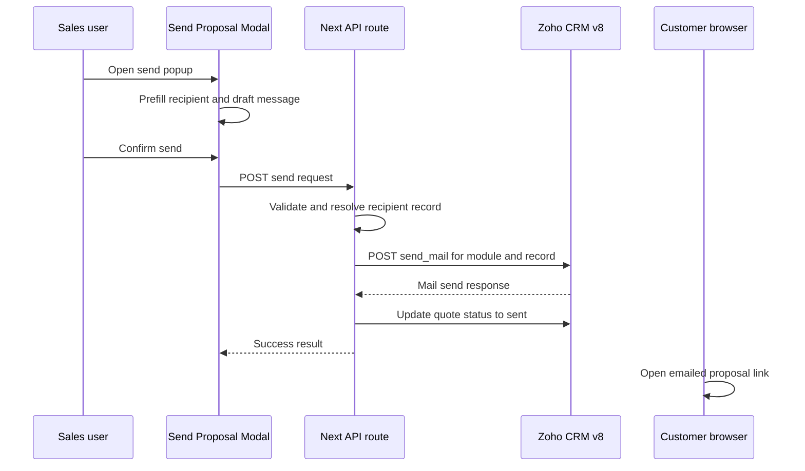

# Send Mail Implementation Plan

## Objective

Implement proposal email sending through the official Zoho CRM v8 Send Mail API documented at `POST /crm/v8/{module_api_name}/{record_id}/actions/send_mail`.

This plan focuses specifically on sending the proposal email after a quote has already been saved and selected.

## Documentation-Based API Summary

Based on the Zoho CRM v8 Send Mail documentation, the implementation should assume:

- endpoint pattern: `POST /crm/v8/{module_api_name}/{record_id}/actions/send_mail`
- authorization header format: `Zoho-oauthtoken <access_token>`
- supported modules include standard modules such as `Leads`, `Contacts`, `Deals`, `Accounts`, `Quotes`, and custom modules
- required OAuth scope is `ZohoCRM.send_mail.{module_name}.CREATE` or `ZohoCRM.send_mail.all.CREATE`
- request body supports email composition fields such as `from`, `to`, `cc`, `bcc`, `reply_to`, `subject`, `content`, and `org_email`
- the API sends mail to email IDs of other records in Zoho CRM

## Architecture Decision

The app should send email through a dedicated Next.js API route, while Zoho CRM performs the actual outbound delivery.

Recommended server endpoint:

- [`app/api/proposals/send/route.ts`](../app/api/proposals/send/route.ts)

Recommended Zoho send target:

- use the Zoho CRM record most appropriate for the client recipient context
- in this application, the first implementation should plan around sending against the CRM record associated with the proposal's customer context, not against an unsaved client-side object

Because the proposal workflow is job-centric and the UI already loads the deal by `jobId` in [`getProposalData`](../lib/mock-data.ts:196), the safest initial assumption is:

- send mail against the related CRM record that contains the recipient email and is already linked to the proposal context
- if the customer email resides on the Deal-linked contact or another related CRM record, resolve that record before calling the Send Mail API

## Recommended Send Flow

### User flow

1. user selects a saved proposal from the proposal list
2. user clicks Send Proposal in [`ProposalHeader`](../components/proposal/ProposalHeader.tsx:15)
3. app opens a draft popup in [`components/proposal/SendProposalModal.tsx`](../components/proposal/SendProposalModal.tsx)
4. user reviews recipient, subject, and message body
5. user confirms send
6. client calls [`app/api/proposals/send/route.ts`](../app/api/proposals/send/route.ts)
7. server resolves the correct Zoho recipient record and submits the send_mail request
8. on success, app updates local UI state and optionally updates quote status to sent

### Preview link behavior

The email content should include a proposal link that opens the selected saved quote in the preview experience.

Recommended link shape:

- [`app/p/[jobId]/page.tsx`](../app/p/[jobId]/page.tsx:4) with a `quoteId` query parameter
- example shape: `/p/[jobId]?quoteId=<savedQuoteId>`

## UI Plan

### Send popup component

Use or complete [`components/proposal/SendProposalModal.tsx`](../components/proposal/SendProposalModal.tsx) with these fields:

- recipient email
- optional cc
- optional bcc
- reply-to email if needed
- subject
- email body
- read-only proposal link preview
- cancel button
- send button

### Default values

Prefill the modal using server-provided proposal context:

- recipient from Zoho contact or related CRM record email
- subject from proposal title and job context
- body from a reusable template
- proposal link from the selected quote and job id

### UI guardrails

Block sending when:

- no saved quote id exists
- no recipient email is available
- the selected proposal has not been saved yet

## Request Contracts

### Client-to-server request

```ts
type SendProposalMailRequest = {
  quoteId: string;
  jobId: string;
  recipientRecordModule: string;
  recipientRecordId: string;
  toEmail: string;
  cc?: string[];
  bcc?: string[];
  replyTo?: string;
  subject: string;
  body: string;
  proposalUrl: string;
  useOrgEmail?: boolean;
};
```

### Server response

```ts
type SendProposalMailResponse = {
  success: boolean;
  quoteId: string;
  recipientRecordModule: string;
  recipientRecordId: string;
  sentAt: string;
};
```

## Zoho Payload Plan

The server should construct the Zoho v8 Send Mail payload based on the official request JSON fields.

Recommended payload shape:

```ts
const payload = {
  data: [
    {
      from: {
        user_name: senderName,
        email: senderEmail,
      },
      to: [
        {
          user_name: recipientName,
          email: toEmail,
        },
      ],
      cc: ccEmails,
      bcc: bccEmails,
      reply_to: replyTo
        ? {
            user_name: senderName,
            email: replyTo,
          }
        : undefined,
      org_email: useOrgEmail ?? false,
      subject,
      content: htmlBody,
    },
  ],
};
```

Implementation notes from the documentation:

- `from` is mandatory and must represent sender name and email address
- `to` is mandatory and is an array
- `cc`, `bcc`, and `reply_to` are optional
- `org_email` is optional and controls whether the organization's email is used for sending
- `content` should be treated as the email body sent to the recipient

## HTML Body Strategy

The app should send HTML content rather than plain text so the proposal link is clearly visible and branded.

Recommended email content sections:

1. greeting using contact name if available
2. brief proposal message
3. primary call-to-action link to view proposal
4. fallback plain URL in the body
5. sender signature

The popup editor can still use a textarea draft model, but the server should transform it into HTML safely before sending.

## Zoho Client Enhancements

Extend [`ZohoCRMClient`](../lib/zoho/ZohoCRMClient.ts:26) with a dedicated helper for the v8 send-mail endpoint.

Recommended helper:

```ts
sendMail(moduleApiName, recordId, payload)
```

Responsibilities:

- use the existing token retrieval mechanism
- point requests to the v8 send-mail path
- surface detailed Zoho send-mail errors to the route

Because the current client is configured around `/crm/v7` in [`ZohoCRMClient`](../lib/zoho/ZohoCRMClient.ts:34), implementation mode should decide between:

1. adding a version-aware request helper for v8 mail endpoints
2. or introducing a separate mail endpoint builder inside [`ZohoCRMClient`](../lib/zoho/ZohoCRMClient.ts:26)

Recommended default: add a version-aware helper so the rest of the client can stay on v7 while send_mail uses v8 explicitly.

## Server Route Plan

Implement [`app/api/proposals/send/route.ts`](../app/api/proposals/send/route.ts) with this sequence:

1. validate request body
2. verify `quoteId` belongs to the given `jobId`
3. resolve the correct recipient CRM record module and record id
4. confirm the resolved record email matches or can supply `toEmail`
5. generate the proposal URL
6. transform the drafted body into final HTML content with the proposal link
7. call Zoho v8 send-mail endpoint
8. on success, optionally update `New_Quotes.Quote_Status` to sent
9. optionally log send metadata on the quote if supported
10. return normalized success response

## Recipient Resolution Plan

The Zoho Send Mail API is record-centric, so the route must know which CRM record it is sending from or against.

Recommended resolution order:

1. use the explicitly selected recipient record if already available in server data
2. otherwise resolve from the Deal loaded by [`getProposalData`](../lib/mock-data.ts:196)
3. otherwise resolve from the saved quote record if it stores contact linkage

This means implementation mode should ensure proposal page data includes enough contact linkage to identify:

- `recipientRecordModule`
- `recipientRecordId`
- `toEmail`

## Quote Status Update Plan

After successful send:

- update `New_Quotes.Quote_Status` from draft to sent
- optionally store send timestamp if the module supports it

If the email fails:

- do not update quote status
- keep the proposal in saved draft state

## Validation Rules

Validate in the server route before calling Zoho:

- `quoteId` is present
- `jobId` is present
- `recipientRecordModule` is present
- `recipientRecordId` is present
- `toEmail` is present and valid
- `subject` is not empty
- `body` is not empty
- `proposalUrl` is a valid application URL

Validate in the client modal before submit:

- email format
- required subject
- required message body

## Error Handling Plan

### Zoho authorization failure

- return a send-specific error from the API route
- show a retry-friendly error in the popup
- do not update quote status

### Recipient resolution failure

- block send before calling Zoho
- show that no valid CRM recipient record could be resolved

### Send Mail API validation failure

- surface Zoho validation details in the server log
- show a user-friendly summary in the popup

### Quote status update failure after successful send

- treat email send as successful
- log a follow-up consistency error for quote-status repair

## Security and Environment Plan

- generate proposal URLs on the server from a trusted app base URL
- never trust a client-provided base URL directly
- do not expose Zoho access tokens to the browser
- keep all send-mail requests server-side

## Implementation Sequence

1. confirm how to resolve the correct Zoho recipient record from current job and quote data
2. add recipient linkage fields to the server-loaded proposal context if missing
3. enhance [`ProposalPageClient`](../components/proposal/ProposalPageClient.tsx:27) with send-modal state and active quote awareness
4. complete [`components/proposal/SendProposalModal.tsx`](../components/proposal/SendProposalModal.tsx) for drafting and validation
5. extend [`ZohoCRMClient`](../lib/zoho/ZohoCRMClient.ts:26) with a v8 send-mail helper
6. implement [`app/api/proposals/send/route.ts`](../app/api/proposals/send/route.ts)
7. update [`handleSend`](../components/proposal/ProposalPageClient.tsx:210) to open the popup and submit to the send route
8. update preview routing in [`app/p/[jobId]/page.tsx`](../app/p/[jobId]/page.tsx:4) so emailed links open the selected quote
9. update quote status after successful send
10. test send success and failure paths

## Sequence Diagram



## Open Confirmation Items

- which exact Zoho record module and record id should be used for the send_mail call in this proposal workflow
- whether the sender should use configured mailbox `from` values or `org_email: true`
- whether Zoho requires any additional email-template or layout configuration in this CRM instance
- whether the email should also be logged to CRM history beyond the send_mail action itself
- exact HTML formatting rules desired for the proposal email body

## Definition of Done for Implementation Mode

- clicking Send Proposal opens a draft popup rather than sending immediately
- the popup is prefilled with recipient, subject, and proposal link data
- confirming send calls [`app/api/proposals/send/route.ts`](../app/api/proposals/send/route.ts)
- the route sends email via the Zoho CRM v8 Send Mail API
- the email contains a link that opens the correct saved proposal
- successful send updates the proposal to sent state
- failed send leaves the proposal saved but unsent and shows an actionable error
